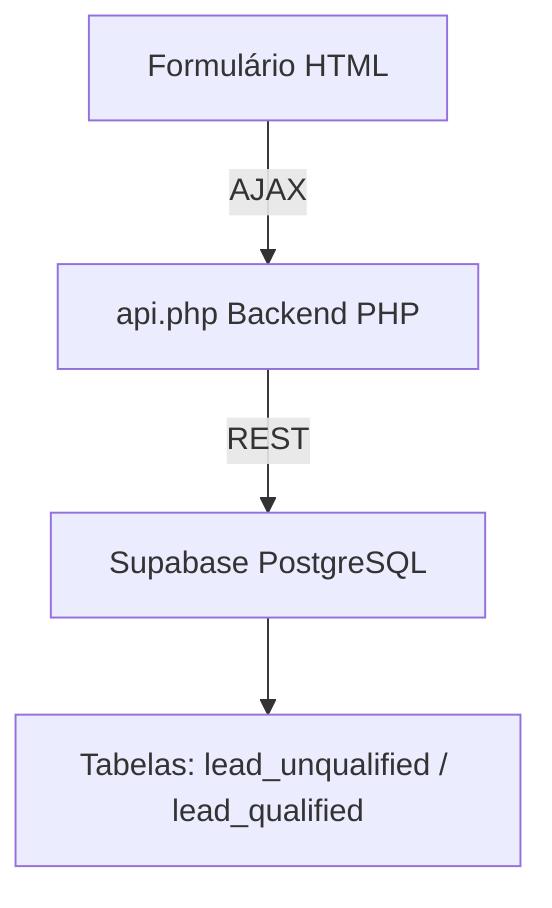

# 🚀 Sistema de Captura de Leads com PHP + Supabase  
_Lead Capture System with PHP + Supabase_

<p align="center">
  <a href="https://www.php.net/" target="_blank" title="PHP Language">
    
  </a>
  <a href="https://supabase.com" target="_blank" title="Supabase">
    
  </a>
  <a href="https://phyonext.com/material/form.html" target="_blank" title="Ver Demo / Live Demo">
    
  </a>
  <a href="https://developer.mozilla.org/en-US/docs/Web/HTML" target="_blank" title="HTML5">
    
  </a>
  <a href="https://developer.mozilla.org/en-US/docs/Web/CSS" target="_blank" title="CSS3">
    
  </a>
  <a href="https://jquery.com/" target="_blank" title="jQuery">
    
  </a>
</p>

---

## 🎯 Objetivo do Projeto | Project Goal

🇧🇷 **Português:**  
Desenvolver um sistema inteligente de **captura progressiva de leads** utilizando **PHP e Supabase**, com foco em automações integradas a redes sociais como o **Instagram**, permitindo envio dinâmico de formulários via Direct Message (DM).  

🇺🇸 **English:**  
Develop an intelligent **progressive lead capture system** using **PHP and Supabase**, focused on social media automation (such as **Instagram**), allowing dynamic form delivery via Direct Message (DM).

---

## 🇧🇷 Descrição  
Sistema completo de **formulário responsivo** com **captura progressiva de leads** e **integração com Supabase**.  
Ideal para uso em **automação com Instagram**, enviando o link do formulário via **mensagem direta (DM)**.  
Tema visual: **Azul Tecnologia - Phyonext**.

🔗 **Demo online:**  
👉 [Acesse aqui](https://phyonext.com/material/form.html)

---

## 🇺🇸 Description  
A complete **responsive form system** with **progressive lead capture** and **Supabase integration**.  
Perfect for **Instagram automation**, where the form link is sent directly to users via **Direct Message (DM)**.  
Visual theme: **Blue Tech - Phyonext**.

🔗 **Live demo:**  
👉 [Open here](https://phyonext.com/material/form.html)

---

## 📋 Índice | Index

- [🚀 Sistema de Captura de Leads com PHP + Supabase](#-sistema-de-captura-de-leads-com-php--supabase)
  - [🎯 Objetivo do Projeto | Project Goal](#-objetivo-do-projeto--project-goal)
  - [🇧🇷 Descrição](#-descrição)
  - [🇺🇸 Description](#-description)
  - [📋 Índice | Index](#-índice--index)
  - [🏗️ Arquitetura | Architecture](#️-arquitetura--architecture)
  - [💻 Requisitos | Requirements](#-requisitos--requirements)
    - [Servidor / Server:](#servidor--server)
    - [Supabase:](#supabase)
  - [📦 Instalação | Installation](#-instalação--installation)
  - [🔧 Configuração do Supabase | Supabase Setup](#-configuração-do-supabase--supabase-setup)
  - [⚙️ Configuração do PHP | PHP Setup](#️-configuração-do-php--php-setup)
  - [📁 Estrutura de Arquivos | File Structure](#-estrutura-de-arquivos--file-structure)
  - [🔄 Funcionamento | How It Works](#-funcionamento--how-it-works)
  - [🔒 Segurança | Security](#-segurança--security)
  - [🧩 Troubleshooting](#-troubleshooting)
  - [👤 Créditos | Credits](#-créditos--credits)
  - [📝 Licença | License](#-licença--license)

---

## 🏗️ Arquitetura | Architecture



- **Fluxo de Dados (Data Flow):**
  1. Cada campo (blur) → `INSERT/UPDATE` em `lead_unqualified`
  2. Envio final → `INSERT` em `lead_qualified` e `DELETE` em `lead_unqualified`

---

## 💻 Requisitos | Requirements

### Servidor / Server:
- PHP ≥ 7.4  
- Extensões: `curl`, `json`, `mbstring`  
- Apache ou Nginx  
- HTTPS recomendado

### Supabase:
- Conta ativa e projeto criado  
- API URL + Public Key configuradas  

---

## 📦 Instalação | Installation

```bash
# Criar diretórios e permissões
mkdir logs
chmod 755 logs
chmod 666 logs/api.log
```

**Estrutura sugerida:**

```
/seu-projeto/
├── assets/
│   ├── css/style.css
│   └── js/script.js
├── config/
│   ├── config.php
│   └── logs/api.log
├── SQL_DLL/DDL_supabase_tables.sql
├── src/SupabaseClient.php
├── form.html
└── .htaccess
```

---

## 🔧 Configuração do Supabase | Supabase Setup

1. Crie um projeto em [Supabase.com](https://supabase.com)  
2. Obtenha a **URL** e **Public Key**  
3. Execute o script `DDL_supabase_tables.sql`  
4. Desabilite RLS ou configure as políticas conforme necessário

---

## ⚙️ Configuração do PHP | PHP Setup

Edite `config/config.php`:

```php
define('SUPABASE_URL', 'https://seu-projeto.supabase.co');
define('SUPABASE_KEY', 'sua-anon-key');
define('ENVIRONMENT', 'production');
```

Teste a conexão:
```bash
php test.php
```

---

## 📁 Estrutura de Arquivos | File Structure

- `assets/css/style.css` → Estilos do formulário  
- `assets/js/script.js` → Lógica jQuery  
- `src/SupabaseClient.php` → Classe de comunicação REST  
- `form.html` → Formulário responsivo  
- `config/config.php` → Credenciais e segurança  

---

## 🔄 Funcionamento | How It Works

- **Captura incremental:** Cada campo é salvo progressivamente  
- **Envio final:** Dados são migrados para `lead_qualified`  
- **Controle de campanhas:** via parâmetro `?u=campanha-xyz`

---

## 🔒 Segurança | Security

✅ Sanitização de dados  
✅ CORS configurável  
✅ HTTPS recomendado  
✅ Logs detalhados  
✅ Proteção .htaccess  

---

## 🧩 Troubleshooting

| Problema / Issue | Solução / Solution |
|------------------|--------------------|
| CORS Error | Adicione domínio em `ALLOWED_ORIGINS` |
| 401 Unauthorized | Verifique API Key e permissões |
| Dados não salvam / Data not saving | Ative modo debug e verifique logs |

---

## 👤 Créditos | Credits

🇧🇷 **Português:**  
Projeto desenvolvido por **Bruno Pelatieri Goulart** como parte de estudos sobre automação de leads com **Supabase e PHP**, integrando boas práticas de segurança, performance e arquitetura limpa.

🇺🇸 **English:**  
Project developed by **Bruno Pelatieri Goulart** as part of research on **lead automation with Supabase and PHP**, integrating best practices in security, performance, and clean architecture.

---

## 📝 Licença | License

© 2025 **Bruno Pelatieri Goulart**  
Desenvolvido com ❤️ usando **PHP + Supabase**  

Distribuído sob a licença **[MIT License](LICENSE)**.  